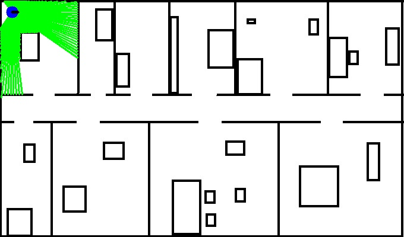

# Cognitive-robotics-assignments
### Assignment 1
This assignment was about generating the laser beams of the robot and calculating the distance between the robot and the end point of the laser beam.
Then using these measurements to construct the end-point model. 
### 📷Screenshots

    <h4 align="center">Measurements</h4>
    
    <h4 align="center">Highest likelihood</h4>
    

